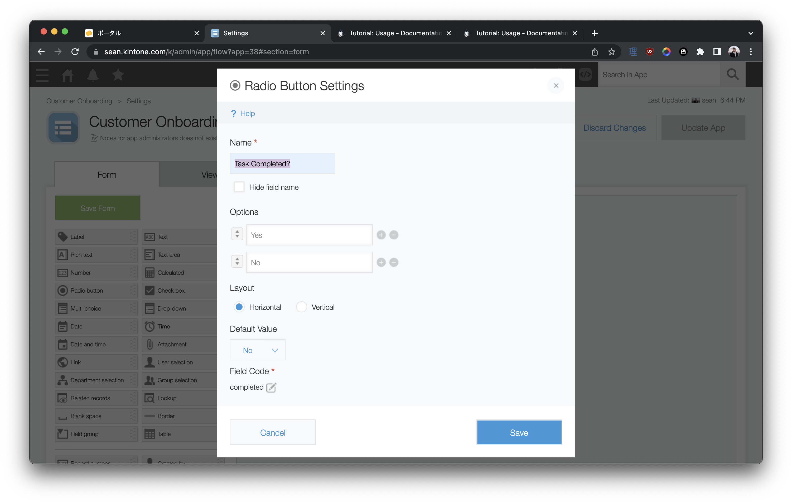
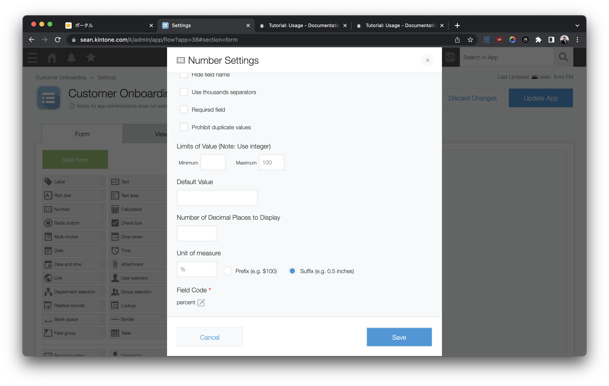

# Onboard Users Like a Wizard 🧙 with Shepherd.JS -- React Basics Tutorials


**Say goodbye to lost users!**  
Onboarding is a valuable feature for your App's first-time users. 💪

Our free, live workshop will walk you through creating a Web Database App, setting up a React project, and developing a tutorial guiding users through the App.

## Outline <!-- omit in toc -->
* [Get Started](#get-started)
  * [frontend & backend folders](#frontend--backend-folders)
* [Get Your Free Kintone Database](#get-your-free-kintone-database)
* [Create a Kintone Web Database App](#create-a-kintone-web-database-app)
* [Kintone API Token](#kintone-api-token)
* [Create a `.env` File](#create-a-env-file)
* [Appendix](#appendix)
  * [What is Shepherd.JS?](#what-is-shepherdjs)
  * [What is Kintone?](#what-is-kintone)
* [Debugging - Let's Fix Those Problems 💪](#debugging---lets-fix-those-problems-)
  * [`npm install` command is not working](#npm-install-command-is-not-working)

---

## Get Started

First, clone the [sean-kintone/shepherd-react-tutorial](https://github.com/sean-kintone/shepherd-react-tutorial) repo!  🚀  
Then go inside the folder.

Once you are inside the folder, let's install the dependencies!

```shell
cd Downloads

git clone https://github.com/sean-kintone/shepherd-react-tutorial

cd shepherd-react-tutorial
```

Open the `shepherd-react-tutorial` folder in [VS Code](https://code.visualstudio.com/docs/getstarted/tips-and-tricks#_command-line)

```shell
code .
```

### frontend & backend folders
Inside there should be two folders: `frontend` & `backend`

1. Open a terminal per folder ~
1. From inside the folders, download the required packages with `npm install`.

|                      | Terminal 1 - Frontend  🌞                          | Terminal 2 - Backend  🌚                          |
| -------------------- | ------------------------------------------------- | ------------------------------------------------ |
| Go inside the folder | `cd ~/Downloads/shepherd-react-tutorial/frontend` | `cd ~/Downloads/shepherd-react-tutorial/backend` |
| What is inside?      | Code for the React App                            | Code for the Express server                      |
| Install packages     | `npm install`                                     | `npm install`                                    |
| To run the scripts   | `npm start`                                       | `npm start`                                      |

## Get Your Free Kintone Database

[bit.ly/KDP_NEW](http://bit.ly/KDP_NEW)
* ⚡ Only use lowercase, numbers, & hyphens in your subdomain
* ⚠ Do not use uppercase or special characters

|                                                                                         |                                                                                                                   |
| --------------------------------------------------------------------------------------- | ----------------------------------------------------------------------------------------------------------------- |
|  |  |

## Create a Kintone Web Database App

Let's create a **ShepherdJS Onboarding** Kintone App!  
This will keep track of two metrics for visitors to our site:

1. Did users complete the task?
1. Did users finished our onboarding?

Here are the required fields & their configurations for our workshop:

| Field Type   | Field Name        | Field Code  | Note                                           |
| ------------ | ----------------- | ----------- | ---------------------------------------------- |
| Radio Button | Task Completed    | `completed` | Options: 'Yes' and 'No'                        |
| Number       | Percent Completed | `percent`   | This will show onboarding tour completion rate |

Be sure to click the **Save** and **Activate App** buttons! 💪

Your Kintone app should look like this, with one `Radio Button` field, and one `Number` field:


Your `Radio Button` settings should look like this (⚠️notice the field code is lower case, `completed`, and your button options are Upper Case `'Yes'` and `'No'`⚠️):


And your `Number` field settings should like as so:


Confused? 🤔 → Check out the [How to Create a Kintone Database App](https://youtu.be/pRtfn-8cf_I) video 📺

## Kintone API Token

To generate an API Token for a Kintone App:

1. Go to the Kintone App
2. Go to the Gear icon ⚙️ (top right corner) > Open the App Settings page
3. Click on the **App Settings** Tab > Click on **API Token** settings
4. Click the `Generate` button to generate a token
5. Click the `Save` button (top left corner) to save the token setting
6. Finally, click the `Update App` button (top right corner) to implement the token setting change.

Confused? 🤔 → Check out the [Get the API Token](https://youtu.be/pRtfn-8cf_I?t=117) video clip 📺  


---

## Create a `.env` File

1. Using the [.env.example](.env.example) file as a template, create a `.env` file.
1. Then input your Kintone credentials like the following:

```txt
SUBDOMAIN = "example"
APPID = "1"
APITOKEN = "abcdefghijklmnopqrstuvwxyz"
```

### ⚠️ DO NOT DELETE THE [.env.example](.env.example) FILE!  <!-- omit in toc -->
[.env.example](.env.example) is used by env-cmd to verify that `.env` file is correctly configured.

---

## Appendix

### What is Shepherd.JS?

Shepherd is a free, open-source JavaScript library for guiding users through your App.

Shepherd.JS is similar to other popular onboarding JS libraries such as Intro.JS and React Joyride but:
* Unlike Intro.JS, Shepherd.JS is free for personal and commercial uses.
* Unlike React Joyride, Shepherd.JS is not limited to React projects.

### What is Kintone?

Kintone is a no-code/low-code cloud platform for teams to quickly & easily share and collaborate on their data.

You can add JavaScript, CSS, &/or HTML to enhance the front-end UI/UX of a Kintone App. This can include features such as maps, buttons, and color-coding.

Read up on how to customize and develop on the Kintone platform at [kintone.dev](https://kintone.dev/)

---

## Debugging - Let's Fix Those Problems 💪

Here is a rundown of common problems that may occur & their solutions!

### `npm install` command is not working

1. Verify the Node.js & npm versions **inside** the `shepherd-react-tutorial` folder
2. Just installed Node.js? Verify you configured Node.js versions **inside** the `shepherd-react-tutorial` folder

* Mac: `nodenv local 14.5.0`
* Windows: `nvm use 14.5.0`
